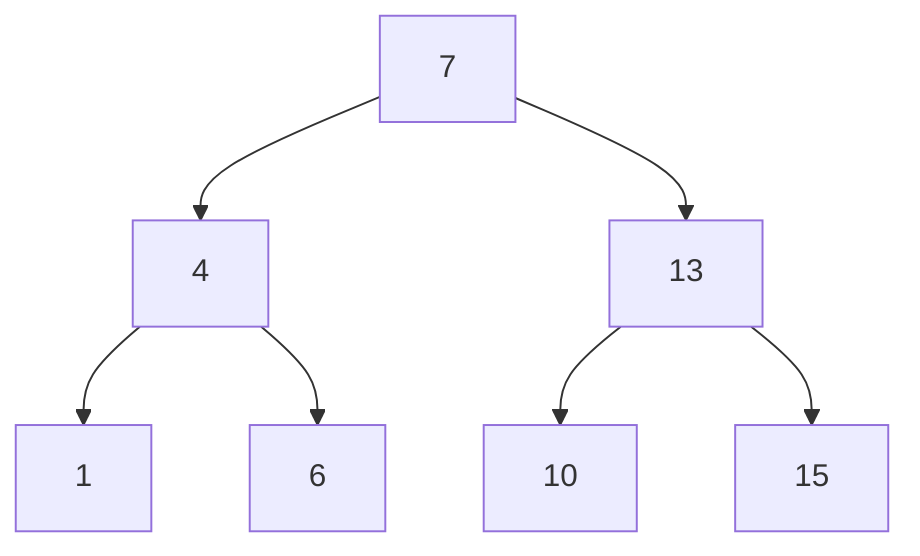

## Binary Search
##### Search an array

## Search Tree
##### The search tree much easier to insert into

## Part of a Tree

- Root node
- Right subtree smaller keys
- Left subtree bigger keys

## Tree Node Data Type
- Key
- Parent
- Left child
- Rigth child

## Idea

#### Find

 

## Algorithms

